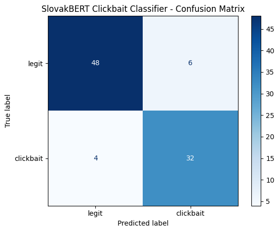
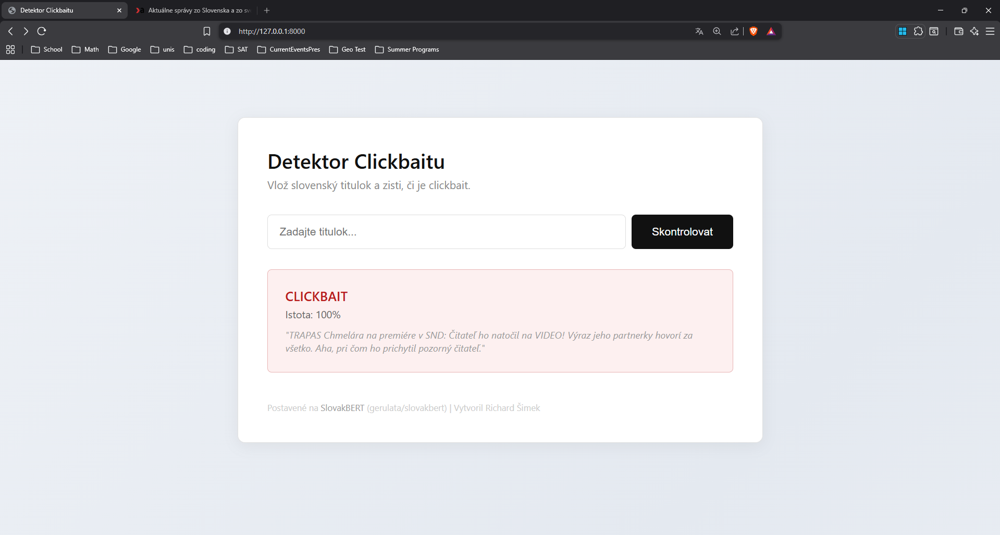

# Slovak Clickbait Detector

Classifies Slovak news headlines as clickbait or legitimate using a fine-tuned [SlovakBERT](https://huggingface.co/gerulata/slovakbert) model. The app runs on FastAPI with a simple web interface.


## Why I built this

There is no public clickbait dataset for Slovak. I scraped 447 headlines from 6 Slovak news sites, manually reviewed every single one, and used them to fine-tune SlovakBERT for binary classification.

Slovak is a low-resource language, so there is not much NLP work done for it compared to English. This project ties into work being done at [KInIT](https://kinit.sk) on disinformation detection (vera.ai, DisAI).

## Results

| Metric | Score |
|--------|-------|
| Accuracy | 89% |
| F1 (macro) | 0.86 |
| Precision (clickbait) | 0.84 |
| Recall (clickbait) | 0.89 |

Tested on 90 held-out headlines (stratified split). Results vary slightly between training runs (F1 between 0.86 and 0.90) because the dataset is small. That is expected.



### Error analysis

The model got 10 out of 90 test headlines wrong. But when I went through each one manually, I found that 3-4 of those "mistakes" were actually mislabeled in the dataset, not real model errors.

For example, a headline like *"Premier Fico sa v Bratislave stretol so srbskym ministrom obrany Gasicom"* was labeled as clickbait (because it came from a tabloid site), but it is clearly a normal news headline. The model correctly called it legit.

This is a side effect of how I labeled the data: the first pass was based on which site published the headline, not the headline itself. Some legit headlines from tabloid sites and some clickbaity headlines from quality outlets got the wrong label. I caught and fixed 31 of these during manual review, but a few slipped through into the test set.

After accounting for these, the model's real accuracy is probably closer to 92-93%.

### It learns language patterns, not topics

Same political topic, different phrasing, different result:

| Headline | Prediction | Confidence |
|----------|------------|------------|
| *Fico oznamil nove opatrenia proti inflacii* | LEGIT | 89% |
| *Fico oznamil nove opatrenia proti inflacii. Tento krok zmeni zivoty tisicov Slovakov* | CLICKBAIT | 89% |

Adding "this step will change the lives of thousands of Slovaks" flips it from legit to clickbait. The model picks up on clickbait phrasing, not just certain topics.



### Where the model fails

I tested the model on 28 new headlines that I wrote myself, designed to test specific edge cases. These headlines were not in the training data. Here is what I found.

**Missing diacritics break detection.** Slovak text online often appears without diacritics (no š, č, ž, ť, etc.). SlovakBERT was trained on properly written Slovak, so when diacritics are missing, the tokens get split differently and the model does not recognize the patterns it learned during training.

| Headline | Prediction | Confidence | Correct? |
|----------|------------|------------|----------|
| *Tato zena z Bratislavy nasla sposob ako schudnut 20 kilo za mesiac* | LEGIT | 63% | No |
| *Nebudte si verili co sa stalo na dialnici pri Zilina* | LEGIT | 97% | No |

Both of these are obvious clickbait. The first one at least has low confidence (63%), which means the model is unsure. The second one is confidently wrong. Without diacritics, the model loses the patterns it learned during training.

**Emotional manipulation without clickbait vocabulary goes undetected.** The model learned specific phrases that appear in clickbait ("pozrite sa", "konecne prehovoril o tom co sa stalo"). But when a headline uses emotional manipulation without those exact phrases, the model misses it completely.

| Headline | Prediction | Confidence |
|----------|------------|------------|
| *Matka troch deti prisla o vsetko po jednej navsteve uradu* | LEGIT | 97% |
| *Slovenska nemocnica odmietla pacienta a ten zomrel pred vchodom* | LEGIT | 99% |
| *Ucitelia su na pokraji zrutenia a nikoho to nezaujima* | LEGIT | 98% |

These headlines use emotional framing that is common in tabloid media. Some of them could arguably appear in quality outlets too, but the style is typical of clickbait. Either way, the model shows no sensitivity to emotional tone at all. It only reacts to the specific words and phrases it saw during training.

**It catches some clickbait phrases but not others.** Even within the "subtle clickbait" category, results were inconsistent:

| Headline | Prediction | Confidence |
|----------|------------|------------|
| *Pozrite sa co sa naslo v detskej vyzive predavanej v Lidli* | CLICKBAIT | 98% |
| *Znamy slovensky herec konecne prehovoril o tom co sa stalo* | CLICKBAIT | 96% |
| *Lekari tvrdia ze tato potravina sposobuje rakovinu a Slovaci ju jedia denne* | LEGIT | 99% |
| *Jedna vec ktoru by ste nikdy nemali robit rano na prazdny zaludok* | LEGIT | 95% |

"Pozrite sa" and "konecne prehovoril" trigger the detector. But "lekari tvrdia" and "jedna vec ktoru by ste nikdy nemali" do not, even though they are classic clickbait patterns. The model learned vocabulary, not the concept of clickbait.

**Same topic, different framing.** When the same story is written in neutral vs. sensational style, the model struggles to tell the difference:

| Headline | Prediction | Confidence |
|----------|------------|------------|
| *NBS zvysila zakladnu urokovu sadzbu na 4,5 percenta* | LEGIT | 99% |
| *Urokove sadzby letia hore. Vase hypoteky budu dramaticky drahsie* | LEGIT | 99% |
| *Pocet turistov na Slovensku vzrastol o 20 percent* | LEGIT | 99% |
| *Turisti zaplavili Slovensko. Pozrite sa kam sa uz neoplatí ist* | LEGIT | 87% |

The second headline in each pair uses sensational framing, but the model still calls them legit. The last one drops to 87% confidence (probably because of "pozrite sa"), but still gets the wrong answer.

**What works well:** short factual headlines (99% confidence), question-style headlines that are genuinely neutral, and headlines that contain well-known clickbait phrases from the training data. The model also correctly handles legit headlines that sound surprising, like *"Vedci z SAV objavili novy druh jaskynneho chrobaka na Slovensku"* (LEGIT, 98%).

**Why this happens:** The model was trained on only 178 clickbait headlines. It learned the specific phrases and patterns that appeared in those examples, but it has not seen enough variety to generalize to all forms of clickbait. This is the main limitation of a small dataset.

## Dataset

447 headlines scraped from 6 Slovak news websites using `requests` + `BeautifulSoup`, then manually reviewed one by one.

Clickbait sources: cas.sk, topky.sk
Legitimate sources: dennikn.sk, pravda.sk, aktuality.sk, tasr.sk

How I labeled them:
1. First pass: labeled by source (tabloid = clickbait, quality outlet = legit)
2. Went through all 447 headlines manually
3. Corrected 31 labels where the source-based label was wrong
4. Removed 18 truncated headlines (ones ending with "...")

Final split: 178 clickbait, 269 legitimate. I used weighted cross-entropy loss during training to handle the imbalance.

The full dataset is in [`headlines_clean.csv`](headlines_clean.csv).

## Model

**Base model:** [gerulata/slovakbert](https://huggingface.co/gerulata/slovakbert). BERT-based transformer pre-trained on ~20 GB of Slovak text, made by Gerulata/KInIT.

**Fine-tuning setup:**
- Binary classification (clickbait vs. legit)
- 5 epochs, best model picked by validation F1 (usually epoch 2-4)
- Batch size: 16, learning rate: 2e-5, weight decay: 0.01
- Max token length: 64 (headlines are short, this is more than enough)
- Custom `WeightedTrainer` with class-weighted `CrossEntropyLoss`
- Trained on Google Colab with a T4 GPU, takes about 2 minutes

The full training notebook is in [`notebooks/`](notebooks/).

## Running locally

**You need:**
- Python 3.9+
- ~4 GB of disk space (the model is about 500 MB, PyTorch is about 2 GB)

**Setup:**
```bash
git clone https://github.com/4Xplos1on/slovak-clickbait-detector.git
cd slovak-clickbait-detector
pip install -r requirements.txt
```

Download the fine-tuned model from [Google Drive](https://drive.google.com/drive/folders/11YiFrgsaFwWIy0VwSFc-ZCpk1IODcJT6?usp=sharing) and put the contents into a folder called `best_model/` in the project root.

Then run:
```bash
uvicorn app:app --reload
```
Open `http://localhost:8000` in your browser.

**API example:**
```bash
curl -X POST http://localhost:8000/predict \
  -H "Content-Type: application/json" \
  -d '{"headline": "Fico oznamil nove opatrenia proti inflacii"}'
```

```json
{
  "headline": "Fico oznamil nove opatrenia proti inflacii",
  "label": "LEGIT",
  "confidence": 0.8941
}
```

## Project structure
```
slovak-clickbait-detector/
  app.py                  # FastAPI backend
  index.html              # Web frontend (all in Slovak)
  requirements.txt        # Python dependencies
  headlines_clean.csv     # The dataset (447 labeled headlines)
  notebooks/              # Training notebook from Google Colab
  screenshots/            # Demo screenshots and confusion matrix
  best_model/             # Fine-tuned model weights (not in git, ~500 MB)
```

## Limitations

- **Small dataset.** 447 headlines is enough to show the idea works, but not enough for a real production system. You would need thousands.
- **Labeling noise.** Initial labels came from which site published the headline. I reviewed all of them manually, but some wrong labels probably still slipped through.
- **Slovak only.** Not tested on Czech or other similar languages.
- **No diacritics handling.** Headlines without diacritics (common in informal Slovak text) confuse the model because SlovakBERT was trained on properly written text.
- **Vocabulary-dependent.** The model catches clickbait phrases it saw during training but misses emotional manipulation and sensational framing that uses different words (see "Where the model fails" above).

## Future work

- **Expand the dataset** using LLM-generated synthetic headlines to increase variety, following approaches from recent research on [synthetic data for low-resource languages](https://kinit.sk/publication/a-rigorous-evaluation-of-llm-data-generation-strategies-for-low-resource-languages/) (Cegin et al., EMNLP 2025).
- **Test cross-lingual transfer** from Czech clickbait data, since Czech and Slovak are closely related and share many clickbait patterns.
- **Add explainability** using attention visualization or occlusion-based methods to show which words the model focuses on when making predictions.
- **Handle missing diacritics** by adding a diacritics restoration step before classification, or by including headlines without diacritics in the training data.
- **Benchmark on standardized Slovak NLP tasks** from skLEP (sentiment analysis, semantic similarity) to better understand how SlovakBERT fine-tuning performs across different text classification problems.

## Acknowledgments

- [SlovakBERT](https://huggingface.co/gerulata/slovakbert) by [Gerulata](https://gerulata.com) / [KInIT](https://kinit.sk)
- [HuggingFace Transformers](https://huggingface.co/docs/transformers), [FastAPI](https://fastapi.tiangolo.com), [PyTorch](https://pytorch.org)

## Author

Richard Simek | [GitHub](https://github.com/4Xplos1on)
